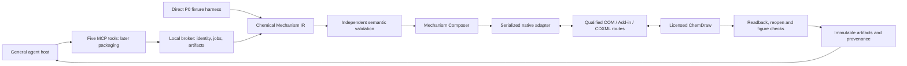

# Native architecture, revision 2026-09-12.3

Status: design contract; the capability matrix separates narrow historical observations from unverified requirements. Shared rules: 2026-09-12.4. Contract major: 1. P0 is a bounded feasibility stage, not a full drawing product.

## Decisions and boundary

1. Use a separate `chemdraw-companion` repository, product identity and runtime namespace. Do not add chemistry business logic to Origin. Start with documentation/contracts plus a small direct four-fixture harness. Extract shared infrastructure only after measured duplication; carry provenance and licences for any reused code.
2. Treat COM, Add-in and CDXML as operation-specific adapters to independent Chemical Mechanism IR and Mechanism Composer. Select verified capabilities from the ChemDraw 26 matrix; Add-in availability is not a prerequisite for testing a permitted COM route. No guessed ProgID, undocumented-call assumption or presumed ChemScript entitlement.
3. Generate initial molecular geometry with a verified native structure input/cleanup route. `addSMILES`/`addInChI` are first candidates. A signed, licensed ChemScript interface or supported desktop command is a secondary probe, not an installed capability by assumption. Whole-page arrangement and electron-flow anchors remain our deterministic, separately checked responsibility.
4. Never repair a rejected layout merely by swapping its renderer. Importing coordinate-bearing CDXML preserves that design. Native-generated fragments may be measured and arranged as a new scene, then imported; record this as native fragment generation plus companion page layout, not vendor-designed page layout.
5. No open-source primary-rendering fallback when `native_required=true` (always true for P0). An unavailable native route returns a blocked result. Independent libraries may check graphs, stereochemistry and atom mappings; they cannot certify electron-flow meaning or visual quality alone.

The cloud adapter is an authenticated transport to the same personal execution broker; it is not another renderer. Reuse a verified existing account connection when authorized, but give this product its own scopes, IDs, queues and artifact namespace. Local operation must work without cloud service or university storage. No second paid model is embedded in the execution layer.

## P0 layers and core asset

P0-A proves transport, P0-B editable object control, and P0-C mechanism composition. P0-C is the largest architecture uncertainty. Execute SaveAs repair -> capability matrix -> S1 -> R1 -> M1 -> M2 before installer/MCP/multi-agent packaging. A pass cannot substitute for B/C. See [matrix](CHEMDRAW_26_CAPABILITY_MATRIX.md), [IR/Composer](MECHANISM_IR_COMPOSER.md) and [M2](M2_BECKMANN_SNAKE.md).

The diagram's recipe/scene compiler comprises independent semantic IR and Composer. The direct developer harness enters there without host/MCP infrastructure. Native molecular layout is an input to composition.

The [generalization gate](M2_GENERALIZATION_GATE.md) forbids reaction-specific layout templates, sample page coordinates, ID-based dispatch and screenshot patches. Production composition uses the general IR/request contracts, not the reference M2 oracle. Base M2 pass is followed by implementation freeze and an untuned asymmetric-oxime holdout before packaging.

## Thin native adapter

Implement an internal capability-based interface, separate from public MCP. Operations: `probe`, `bindDisposableDocument`, `snapshot`, `insertStructure`, `applyScene`, `serializeEditable`, `exportFigure`, `openCopy`, `inspectReadback`, `release`. These are OUR interface names, not claims that the vendor API has these methods. Each method declares its actual backend and required capabilities.

P0 probe order:

- Repair SaveAs with immutable requested paths, captured by-ref returns and controlled comparisons. Keep original success/failure evidence and distinguish vendor errors from wrapper assertions.
- Qualify document binding before mutation; fill the ChemDraw 26 operation matrix. Unsafe native operations stay blocked while independent read-only IR/Composer work continues.
- Probe atom/bond/curve/anchor/lone-pair/charge/transform/cleanup/identity independently. CDXML import is a candidate, not automatic proof.
- Run S1 -> R1 -> M1 -> M2 through the direct harness. M2 requires independent CDX and CDXML disk reopen/edit plus full-scene export at verified native ink resolution.
- Diagnose M2 with native-reference/frozen-geometry controls before broadening installers/transports/hosts.

No native call runs solely because a named function exists. The capability result records `documented`, `detected`, `native_verified`, `failed`, `unsupported` or `unverified`, the test ID, backend, scope, application version and timestamp. Host verification is a separate field. Do not collapse this evidence into one boolean.

## Identity, document binding and concurrency

A session identifies an authenticated principal, execution device, broker instance, worker generation, application process identity, native document binding and scene revision. Never accept a title, current window or file path alone as authority to edit. Native IDs are internal; hosts receive opaque session IDs and revision tokens.

One process-wide native write lane is the default; separate host conversations queue. In addition, atomically reserve each session revision for one in-flight mutation job before native preflight. The reservation binds the parent revision, job ID and worker generation. A second continuation is rejected or queued without reading an assumed future revision. Commit uses compare-and-swap against the same parent revision and reservation token; a failed compare-and-swap quarantines the disposable output and never advances the session. Native serialization alone is not a revision commit. A broker lock excludes other plugin jobs, not human input. Before EACH native mutation, the worker must verify the intended document and expected readback fingerprint. Repeat after mutation. Add-in messages include a paired nonce and worker generation to reject stale callbacks.

The Add-in documentation only identifies an active document, without a documented stable document ID or atomic compare-and-write. P0 must experimentally qualify whether a retained document handle stays bound when focus changes. Do not equate a content hash with document identity: identical blank documents have identical hashes. Accept a binding only if a verified document handle OR a plugin-owned isolated application/document lifecycle unambiguously excludes another target. Application focus alone is insufficient. If exclusivity cannot be established, stop before mutations; provide a supervised probe, not an unattended-support claim.

P0 creates disposable plugin-owned documents. Importing an existing document means copying its bytes into a private job directory first. Original files and open user documents are never modified. Continued edits produce a new version in the same session after an exact expected-revision check; final outputs are immutable. Unsupported objects in imported CDX/CDXML cannot be silently dropped by a scene conversion. Preserve them losslessly through the vendor document or return `UNSUPPORTED_OBJECT`.

Use a monotonic scene revision plus a normalized semantic-and-appearance digest. Native serializers may reorder XML/object IDs: keep byte hashes for integrity and separate normalized graph, drawable-object and style fingerprints for equivalence. Unexpected manual changes invalidate the lease with `REVISION_CONFLICT`. A change of application process, worker generation or document binding invalidates all pending mutation tickets.

A check-before/check-after protocol alone cannot eliminate an active-document race. The adapter must pass the deliberate document-switch test. If the only safe route is a supervised single-document session, advertise exactly that constraint. Do not enable editing arbitrary already-open documents in P0.

## Typed scenes and native layout

Recipes take chemical intent, not unrestricted JavaScript, shell snippets or arbitrary native calls. A scene contains stable component IDs, atom/bond references, participant roles, explicit labels/charges, stereochemistry and constraints. Electron flows contain explicit donor and acceptor references, electron count and intended bond/charge changes. An unspecified named mechanism is an intake error, not permission to substitute a canned mechanism.

Native engine establishes molecular geometry when supported. The companion arranges component boxes, conditions, reaction arrows and electron-flow curves using deterministic constraints. Preserve bonds/stereocentres within native fragments; translation and rotation are allowed only if wedges and labels remain meaningful. Never reflect a stereochemical fragment without semantic revalidation. Any CDXML construction or transformation records its producer independently of the final native image.

Apply a named versioned style profile with explicit units and final physical size. Start with `chembridge-review-v1`: a provisional house profile, not university, ACS or other publication certification. S1/R1/M1 use a fixed 85 mm canvas; M2 uses 170 mm x 230 mm with three snake rows. M2 is an internal test profile, not a change to existing recipe defaults. The width is not an instruction to stretch the ink bounding box. Keep the effective font sizes and bond lengths in physical units; center/arrange content within the canvas without fit-to-width scaling. Numeric style values must be recorded in the result rather than inherited silently from a user's last document. Resolve the entire effective style from the proposed profile and native template before first dispatch, freeze its SHA-256, and record it with every output. Native defaults cannot silently fill missing values in an accepted run. Owner review remains pending until performed and references that frozen style; later style changes require a new profile version.

Lay out fragment rows and labels first, reserve condition and charge/lone-pair regions, then route curved arrows with explicit source/target ports. Run deterministic collision/geometry checks and render through ChemDraw. At most two bounded layout repairs in a job; otherwise return a reviewable failed-quality artifact. A passing native export never clears failed chemical or visual checks.

## Job durability and recovery

Persist an atomic job record, operation intent, idempotency key, request digest, identity and expected revision BEFORE writing. Start with atomic files and OS locks, plus a bounded event journal; add a database only for a demonstrated need. Store live state outside sync. ACKed submissions survive broker restart.

States: `queued -> preflight -> running -> verifying -> succeeded`. Alternatives: `needs_input`, `blocked`, `failed`, `cancelled`, or `outcome_unknown`. These are job states, not product release approvals. `succeeded` means required automated recipe checks passed; owner review, host receipt and release approval retain separate statuses.

Idempotency is principal/device scoped. Same key + same canonical request returns the existing job; same key + different request is `IDEMPOTENCY_CONFLICT`. Timeouts and lost callbacks after a write enter `outcome_unknown`. Reconcile the existing journal, document and artifacts before any new submission. Never blindly append/import again. Return a checkpoint and read-only inspect action when safe reconciliation is impossible.

Cancellation is cooperative at declared safe boundaries. After a native call has begun, show `cancellation_requested`; terminal `cancelled` requires verified quiescence. Do not kill a user's ChemDraw process or roll back over manual changes. If the worker crashes, quarantine the disposable job and mark its document lease invalid. Recovery creates a new disposable copy from the last verified checkpoint; it does not overwrite a published artifact.

Initial budgets are configurable engineering limits, not performance claims: 2-second submission acknowledgement, 20-second maximum long poll, 180-second S1/R1/M1 recipe execution deadline (M2 declares its own finite developer-test deadline), bounded native call timeouts and 2 layout corrections. Record actual timings. Use one native lane; cap queue length and reject excess work with retry guidance. Keep compact status responses below a 4 KiB target and expensive schemas/images on demand.

## Security and artifact delivery

Bind the local broker to loopback only; validate Host/Origin and reject unauthorized callers. Do not use permissive CORS, URL query-string secrets or a publicly exposed desktop control port. Pair a packaged local add-in with short-lived one-use bootstrap material, then reuse per-user encrypted credentials. The feasibility probe must confirm which local transport the installed add-in webview actually permits; do not assume WebSockets, file URLs or TLS behavior. Do not bypass vendor/browser security if a route is blocked.

Authenticate every job, event and artifact request. Enforce principal/session ownership even when callers know another UUID. Scope export destinations to opaque authorized destination IDs, resolve paths inside registered roots, reject traversal and unsafe reparse targets. Artifact retrieval resolves registered IDs, never caller-supplied arbitrary filesystem paths. Local paths are not cloud-accessible links.

Store native file bytes, exported figures, source scene, style settings, quality report and manifest as immutable, hashed artifacts. Record each producing/transformation stage and reopen results. Transport may stream an attachment or issue an expiring authenticated download. Mark host receipt only after observed transfer/readback evidence; a link merely being returned is `available`. The user's chosen authorized destination governs delivery, not OneDrive.

## Installation and versioning

One product entry, stable tool names, stable product ID `chembridge.chemdraw-companion`. Protocol contract major 1, recipe/style versions, broker version, add-in version and tool-manifest SHA-256 are separate. Reject incompatible broker/add-in pairs; do not silently use stale host tools. Discovery support does not establish a fresh host workflow.

Target a per-user Windows package with bundled runtime, self-test and readable status/repair UI. Do not bundle ChemDraw, licensed SDKs or activation material unless redistribution permission is established. Detect per-user/system installations and report missing prerequisites precisely. Add-in Manager installation may remain a guided manual step; count it and never label it one-click automation until proved.

Stage updates beside the active version, drain jobs, preserve encrypted credentials/configuration and switch only after handshake/self-test. Retain a working previous version and a config snapshot. Use backward-compatible state migration or explicit rollback migration; a binary rollback cannot repair an incompatible data schema by itself. Uninstall removes only owned registrations and offers preservation of user artifacts/configuration; do not touch Origin or ChemAIst.

P0 has no installer/release pass. Later delivery uses English GitHub Releases, checksums, compatibility table, measured size/startup/memory, upgrade/reinstall/path-variation/recovery evidence and a real Terra max host workflow.
